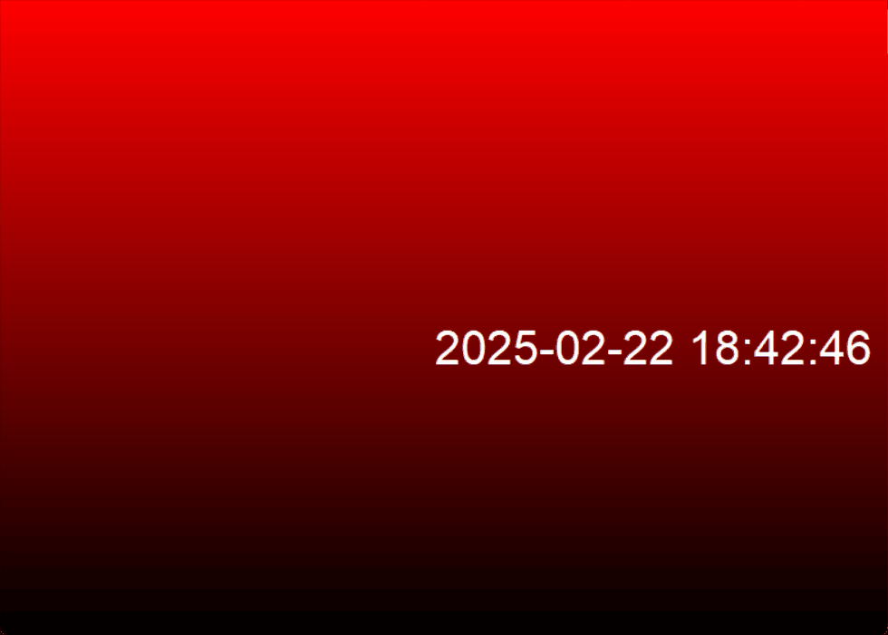
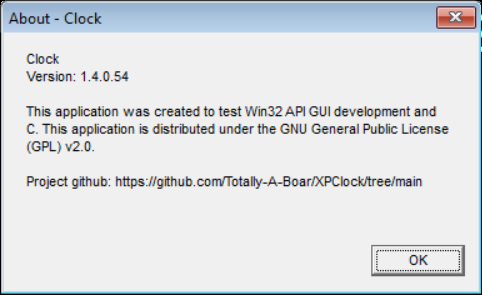

# XPClock

XPClock is a lightweight, lightly-customizable clock application for Windows XP (And all versions after) that brings a retro touch with semi-modern functionality. It is built purely in C and Win32 API. It uses GDI for text rendering and the C standard library for the backend.
##
_"Time is what we want most but what we use worst." - William Penn_
##

## Features

- **Dynamic Text Resizing**: The clock text automatically resizes based on the window size.
- **DVD Logo Effect**: A visually-pleasing DVD logo animation that moves around the screen. You can toggle this by pressing the `F2` key and toggling it on the settings menu.
- **Red Gradient Background**: Option to toggle a red gradient background, also by the settings menu.
- **AM/PM and 24-Hour Format**: Easily switch between 12-hour (AM/PM) and 24-hour time formats by pressing the `T` key.
- **Date Display**: Toggle between displaying the date and just the time, by pressing the `F` key.
- **Full-Screen Mode**: Expand the clock to full-screen or switch back to windowed mode, by pressing the `F11` key.

## Installation

1. Download the latest release from the [GitHub Releases page](https://github.com/Totally-A-Boar/XPClock/releases).
2. Extract the ZIP archive to a location of your choice on your system.
3. Double-click `Clock.exe` to launch the application.

## License

XPClock is open-source software licensed under the **GNU General Public License v2.0**. See the [LICENSE](LICENSE) file for full details.

## Contributing

Contributions are welcome! Feel free to fork the repository, create a new branch, and submit a pull request. If you have any feature suggestions or bug reports, please open an issue.

## Build Instructions
I used Visual Studio 2022 with toolset `141_xp` for Windows XP compatibility. The source that I provided will not run on any Windows version before NT. This is because my source only supports Unicode (wide) encoding, which Windows 98, and versions before, does not support.
I have not tried to compile it using any other compiler other than MSVC (`cl.exe`), but it probably can be done. To compile this yourself, simply download the source, open it in Visual Studio, and then click the Start button.

## Gallery
A demonstration of the application running on Windows 11, with the Gradient background and DVD logo effect toggled:

The about box of the application, running the newest version

---

XPClock is licensed under the GNU GPL v2.0. It’s free software, so feel free to modify and distribute it under the terms of the license.
