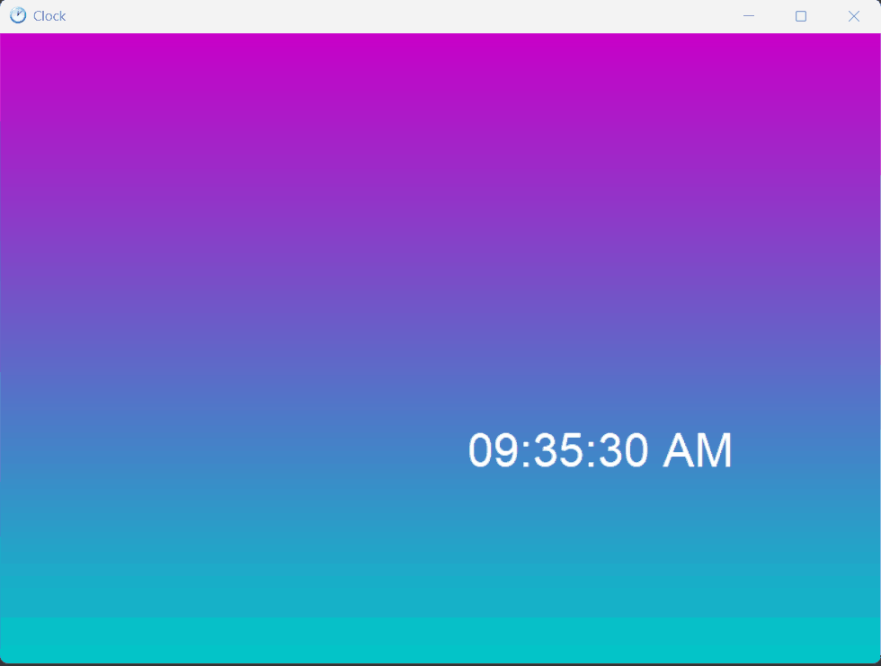
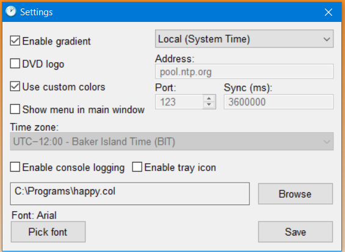
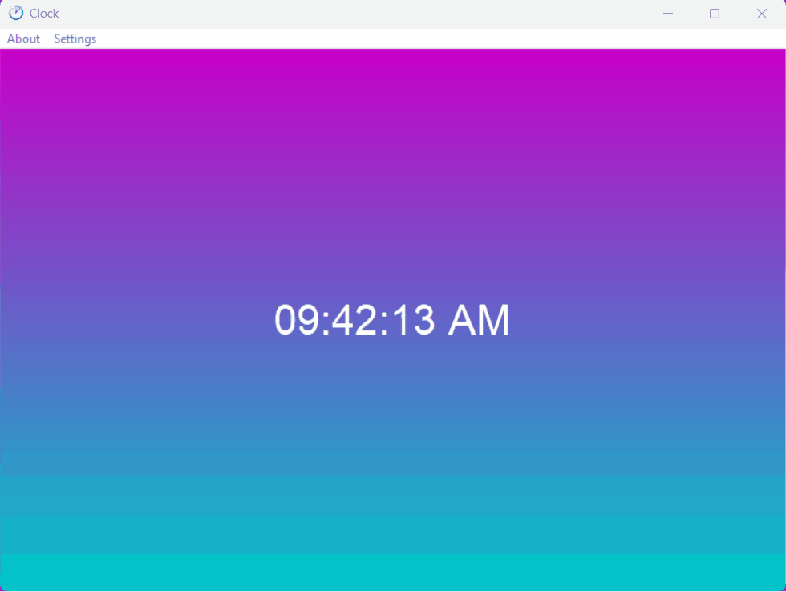

# XPClock

_"Time is what we want most but what we use worst." - William Penn_
##

XPClock is a lightweight, lightly-customizable clock application for Windows XP SP2 (And all versions after). It is built mainly in C and Win32 API. It uses GDI for text rendering and the C standard library for the backend. 

## Contributing

Contributions are welcome! Feel free to fork the repository, create a new branch, and submit a pull request. If you have any feature suggestions or bug reports, please open an issue.

## Gallery
Main window

The about box of the application, running the newest version

The new & improved settings window with NTP time and other features

## NTP Time
# ⚠️ This is for advanced users. I do not recommend doing this on your own if you do not know what you're doing. ⚠️
The official guide is availabe in the [Wiki](https://github.com/Totally-A-Boar/XPClock/wiki/How-to-setup-NTP-time). It is strongly recommend to read this article to set it up.

With the release of v1.6, network time was added via the use of [WinSock2](https://learn.microsoft.com/en-us/windows/win32/api/winsock2/).
If you don't know how NTP works, I suggest you learn first. [Here](https://www.techtarget.com/searchnetworking/definition/Network-Time-Protocol) is an article that explains what NTP is 

You can toggle it via the settings menu. By default, the NTP client uses `pool.ntp.org`, however this is changable by the address text box in the settings menu.
You may also customize the port and the sync interval. By default those values are `123` and `3600000` respectively. Sync interval is stored in milliseconds.

## Console logging
A console logging feature was added to assist in debugging and troubleshooting. It is available by checking the check box that says `Enable console logging`

---

XPClock is licensed under the GNU GPL v2.0. It’s free software, so feel free to modify and distribute it under the terms of the license.
