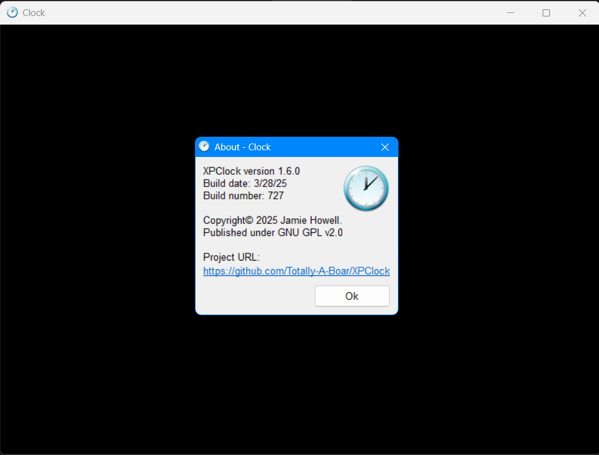

# XPClock

XPClock is a lightweight, lightly-customizable clock application for Windows XP SP2 (And all versions after). It is built purely in C and Win32 API. It uses GDI for text rendering and the C standard library for the backend. 

##
_"Time is what we want most but what we use worst." - William Penn_
##

## Installation

1. Download the latest release from the [GitHub Releases page](https://github.com/Totally-A-Boar/XPClock/releases).
2. Extract the ZIP archive to a location of your choice on your system.
3. Double-click `Clock.exe` to launch the application.

## License

XPClock is open-source software licensed under the **GNU General Public License v2.0**. See the [LICENSE](LICENSE) file for full details.

## Contributing

Contributions are welcome! Feel free to fork the repository, create a new branch, and submit a pull request. If you have any feature suggestions or bug reports, please open an issue.

## Gallery

The about box of the application, running the newest version

Version 1.5 added the ability to create a `.color` file to use a custom RGB color for both gradient and plain background effects.
Here is an example of a `.color` file.

This configuration would result in this:

---

XPClock is licensed under the GNU GPL v2.0. It’s free software, so feel free to modify and distribute it under the terms of the license.
